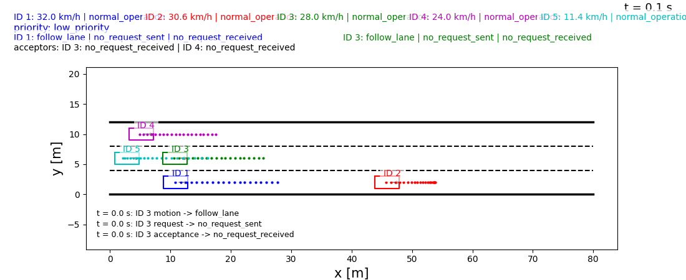
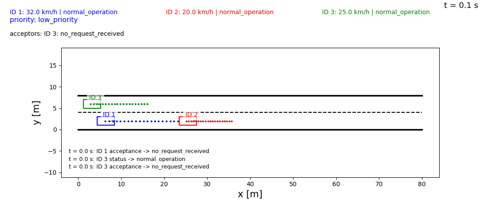
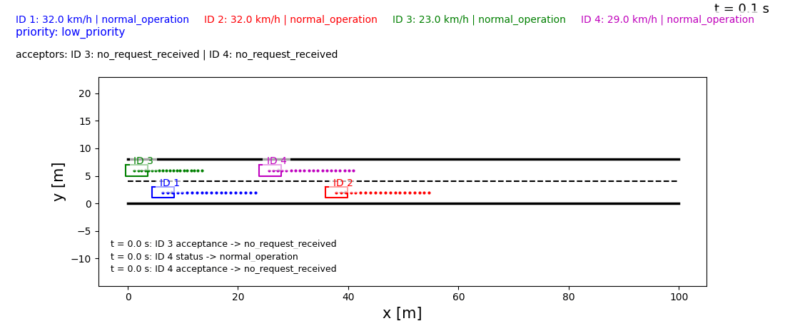
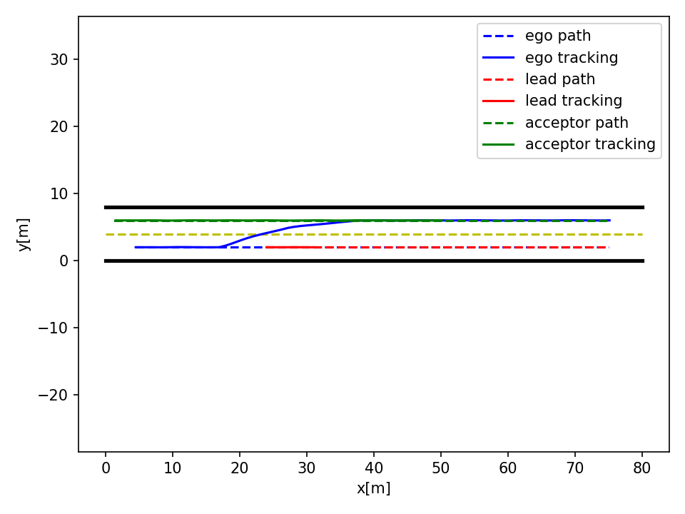
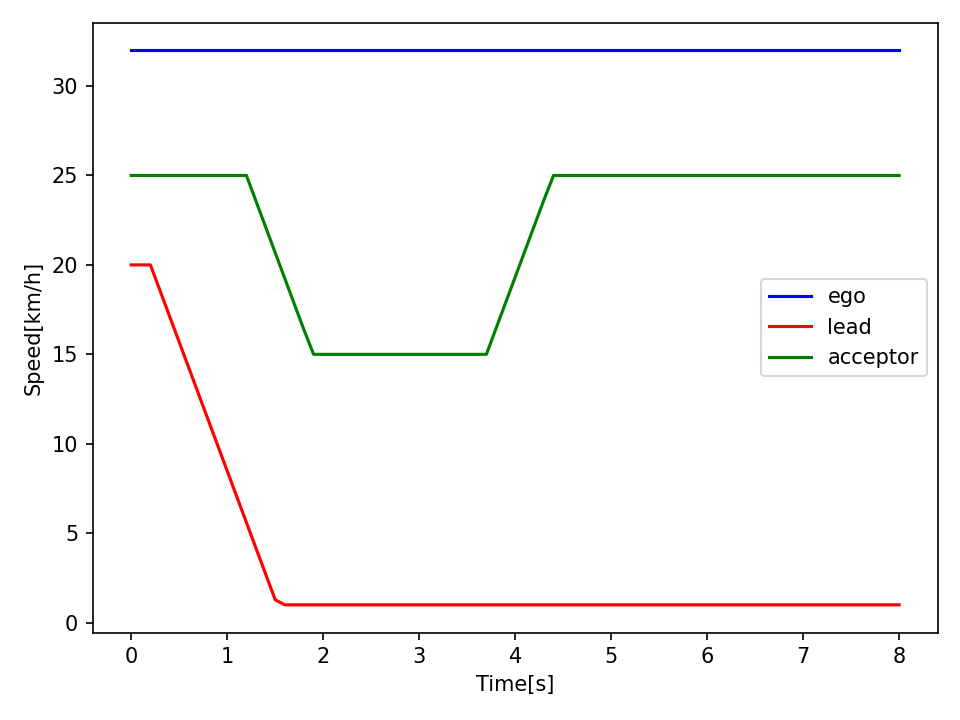
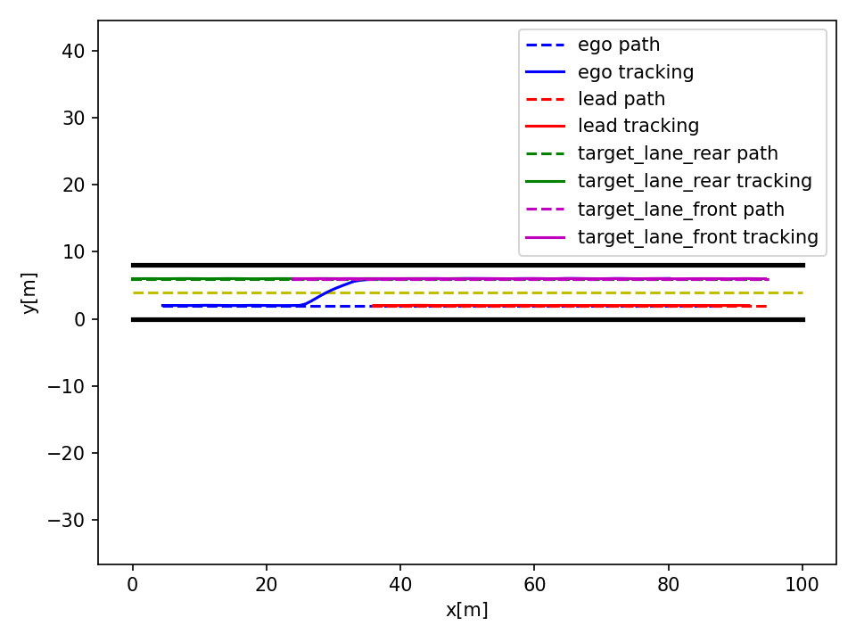
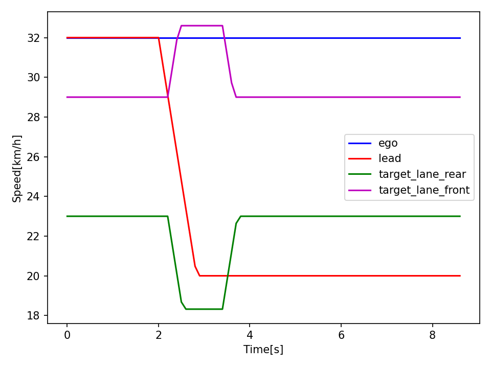
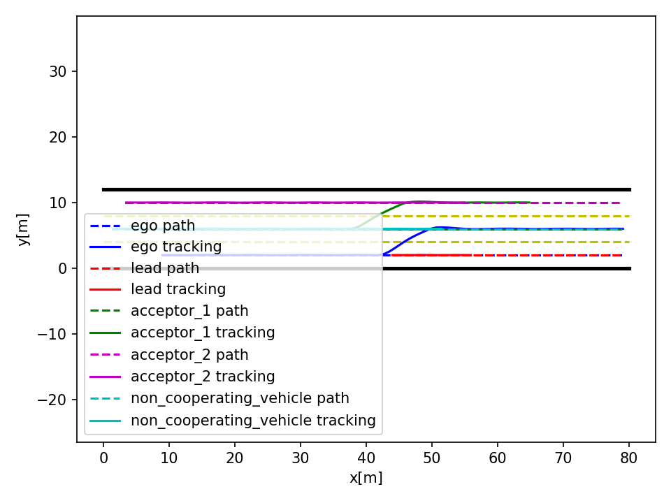
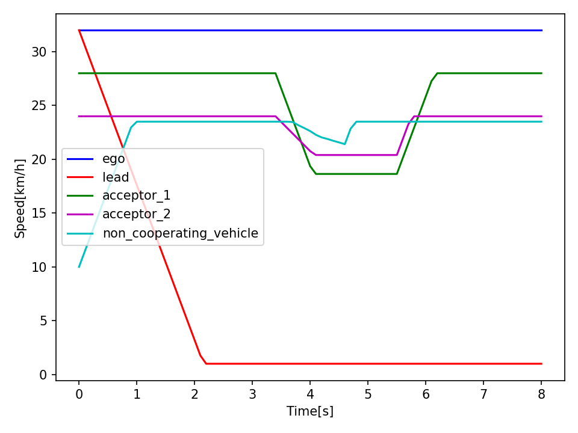

# Maneuver Coordination

Python simulation framework for cooperative lane-change planning, maneuver coordination, and cascading coordination among multiple vehicles on a multi-lane road.

Originally developed as a research prototype, the codebase was restructured into a clean and modular package architecture to improve usability, readability, and extensibility.

AI-assisted development (Codex) was used to support refactoring, code structuring, and iterative improvements, while system design, algorithms, and validation were developed and verified independently.

The project demonstrates scalable coordination strategies and serves as a foundation for further research in connected and automated driving.

## Demo

### Cascading Coordination



### Two-Vehicle Coordination



### Three-Vehicle Coordination



### Summary Plots

| Scenario | Trajectory Tracking | Speed Profiles |
| --- | --- | --- |
| Two vehicles |  |  |
| Three vehicles |  |  |
| Cascading |  |  |

## Paper and Citation

This repository is closely related to the following paper and should be read as a practical codebase built around the same PriMa coordination ideas:

- Daniel Maksimovski, Christian Facchi, and Andreas Festag, "Priority Maneuver (PriMa) Coordination for Connected and Automated Vehicles," in *2021 IEEE International Intelligent Transportation Systems Conference (ITSC)*, pp. 1083-1089, 2021. DOI: `10.1109/ITSC48978.2021.9564923`

Paper link:

- [ResearchGate publication](https://www.researchgate.net/publication/355579428_Priority_Maneuver_PriMa_Coordination_for_Connected_and_Automated_Vehicles)

If you use this repository in your work, please cite the paper above. For a better understanding of the coordination concept and for easier further development of this codebase, it is strongly recommended to read the paper first. The paper should be treated as the conceptual reference and as a source of example coordination cases, while the repository also includes additional engineering extensions and experimental scenarios beyond a strict paper reproduction. BibTeX:

```bibtex
@INPROCEEDINGS{Maksimovski-ITSC2021,
  author={Maksimovski, Daniel and Facchi, Christian and Festag, Andreas},
  booktitle={2021 IEEE International Intelligent Transportation Systems Conference (ITSC)},
  title={{Priority Maneuver (PriMa)} Coordination for Connected and Automated Vehicles},
  pages={1083-1089},
  year={2021},
  doi={10.1109/ITSC48978.2021.9564923},
}
```

## Acknowledgements

Several motion-planning algorithms in `maneuver_coordination/motion_planning/`, including implementations related to Hybrid A*, RRT, RRT with Reeds-Shepp steering, Reeds-Shepp path generation, and cubic-spline planning, are adapted from the excellent [PythonRobotics](https://github.com/AtsushiSakai/PythonRobotics) project by Atsushi Sakai and contributors.

PythonRobotics is distributed under the MIT License. The adapted files keep their original author notes where applicable, and this repository builds the maneuver-coordination simulation logic on top of those planning examples. See [THIRD_PARTY_NOTICES.md](THIRD_PARTY_NOTICES.md) for the third-party license notice.

## License

This project is released under the MIT License. See [LICENSE](LICENSE).

If you use this repository for academic or published work, please cite the PriMa paper listed above. GitHub-compatible citation metadata is also provided in [CITATION.cff](CITATION.cff).

## What This Repository Simulates

The project simulates vehicles that:

- continuously follow and update planned lane-centered trajectories
- detect when a vehicle ahead is slowing down
- decide whether to brake or search for a coordinated lane-change maneuver
- generate requested trajectories for lane changes
- exchange simple V2X-style request messages
- accept, reject, or adapt to requests based on conflict checks and cooperation logic
- compare several cooperative adaptation candidates instead of relying on only one fixed response
- perform cascading coordination, where one coordinated vehicle may request cooperation from another vehicle downstream

In PriMa paper terms, the current implementation works around:

- planned trajectories (PT), continuously followed and updated by vehicles
- requested trajectories (RT), used for coordinated maneuver negotiation
- offer-style responses in the explicit multi-vehicle message scenario
- priority-based acceptance logic for low, medium, and high urgency requests

The paper assumes a decentralized V2V setting with a message rate of `10 Hz` and a short trajectory horizon of about `2 s`. The current simulation is aligned with that style of coordination and uses a simulation step of `0.1 s`, while still keeping some engineering simplifications for experimentation. Not every runnable scenario in this repository is meant to be an exact reproduction of a paper scenario; instead, the paper serves as the main conceptual reference for the coordination approach and for future scenario design.

In the cascading scenario, the intended chain is:

- `ID 1 -> ID 3`
- `ID 3 -> ID 4`

So the first vehicle requests a maneuver to the next relevant vehicle, and that vehicle can in turn request cooperation from another vehicle farther ahead.

## Current Scenarios

The repository currently supports multiple runnable coordination scenarios.

### `two_vehicles_coordination`

A smaller coordination scenario on a 2-lane road:

- one requesting vehicle
- one vehicle ahead in the original lane
- one vehicle in the target lane that can cooperate

Run it with:

```bash
python run.py two_vehicles_coordination
```

### `three_vehicles_coordination`

A three-vehicle coordination scenario on a 2-lane road:

- `ID 1` is the requesting vehicle
- `ID 2` is the slowing vehicle ahead that triggers coordination
- `ID 3` is the rear target-lane vehicle and cooperates by slowing down
- `ID 4` is the front target-lane vehicle and cooperates by speeding up

The goal of this scenario is to create a safe gap through coordination between three vehicles so that `ID 1` can change lane and continue driving in the target lane.

Run it with:

```bash
python run.py three_vehicles_coordination
```

### `three_vehicles_coordination_4_messages`

A three-vehicle coordination scenario with a more explicit message-exchange flow:

- maneuver request
- maneuver offer
- offer confirmation
- maneuver acceptance and execution

Run it with:

```bash
python run.py three_vehicles_coordination_4_messages
```

### `cascading_coordination`

A larger 3-lane coordination scenario:

- `ID 1` starts in the lower lane and may request a maneuver
- `ID 2` is the vehicle ahead that triggers the need for coordination
- `ID 3` is the first coordinated vehicle and can become a secondary requester
- `ID 4` is the downstream vehicle for cascading coordination
- `ID 5` is non-cooperating traffic that follows its lane with ACC-style behavior

Run it with:

```bash
python run.py cascading_coordination
```

### `rejected_request_then_free_lane`

A rejection-and-fallback scenario:

- `ID 1` sends a coordination request
- the request is rejected
- `ID 1` falls back to ACC-style following behind the slowing lead vehicle
- once the adjacent lane becomes free, `ID 1` performs the lane change without cooperation

Run it with:

```bash
python run.py rejected_request_then_free_lane
```

The default `run.py` entrypoint still launches the cascading scenario if no argument is provided.

## How The Coordination Works

At a high level, the simulation loop does the following:

1. Each vehicle follows a planned trajectory.
2. Runtime neighborhood checks determine which vehicle is ahead in the current lane.
3. If a vehicle ahead is slowing down and the gap becomes unsafe, a lane-change search is triggered.
4. The requesting vehicle computes a priority level and builds a requested trajectory for the candidate lane change.
5. Conflict checks are performed against relevant vehicles in the target lane.
6. A V2X-style request is emitted:
   for example `ID 1 -> ID 3 request sent`
7. The receiver evaluates whether a conflict-free adaptation exists within the allowed response effort.
   Cooperative candidates are evaluated in `5%` speed-adaptation steps:
   - low priority: up to `20%`
   - medium priority: up to `40%`
   - high priority: up to `75%`
8. The chosen cooperative response is then tracked with bounded acceleration / deceleration:
   - low priority: up to about `2.0 m/s²`
   - medium priority: up to about `4.0 m/s²`
   - high priority: stronger adaptation if needed
9. Depending on the scenario, the response can follow:
   - direct request / accept-reject
   - request / offer / confirm / accept
   - cascading request downstream
10. If all required vehicles agree, the requester executes the maneuver.
11. Vehicles track their active paths with feedback control.

This means the repository currently supports the three main coordination styles described in the paper:

- direct coordination
- multi-vehicle coordination
- cascading coordination

and also includes one practical extension for experimentation:

- rejection followed by ACC-style fallback until the adjacent lane becomes free

## Runtime Roles vs. Static Identity

One important design direction in this repository is separating:

- stable identity: `vehicle_id`
- runtime behavior/state: `normal_operation`, `requester`, `acceptor`
- runtime traffic relations: vehicle ahead, target-lane front vehicle, target-lane rear vehicle

This means the visible simulation and logging no longer depend on fixed labels like “lead” or “acceptor” as permanent external identities.

Internally, some scenario setup still uses named roles such as `ego`, `acceptor_1`, or `acceptor_2`, but the code has been moving toward:

- dynamic requester selection
- dynamic cooperating-vehicle selection
- runtime lane-based neighbor detection
- message-driven coordination

## Lane Handling

Vehicles are configured with initial `lane_id` and `target_lane_id`, but runtime lane interactions are increasingly based on current vehicle position.

Right now:

- lane-neighbor checks use runtime lane estimation from current `y`
- this avoids treating a vehicle that already changed lanes as if it were still in its original lane
- non-cooperating traffic only reacts to vehicles actually ahead in its current lane

This is an important step toward fuller runtime lane-state tracking.

## V2X-Style Message Model

The repository includes a simple message layer:

- requests are emitted every simulation step when a requester is actively sending a request
- messages contain sender ID, receiver ID, priority, and small payload metadata
- each receiver has a per-step inbox
- accept/reject logic is gated by delivered request messages

The paper-oriented message concepts represented in the repo are:

- request
- offer
- confirm
- accept
- reject
- execute-style maneuver approval
- cascading request/response behavior

This is still a simplified communication model. Vehicles still have direct access to some shared trajectory information for conflict checking, and not every paper-level message type is fully modeled yet. In particular, `cancel`, `abort`, `emergency`, and explicit unique request-ID handling are not yet represented as complete end-to-end features in the current implementation.

## Visualization

The live simulation includes:

- unique vehicle colors
- current vehicle positions and IDs
- short-horizon future planned trajectories shown as vehicle-colored dots
- requested cooperative trajectories shown as yellow dots while the cooperative request is active
- vehicle IDs drawn near each vehicle
- a top overlay showing speed and dynamic coordination status
- a small recent-events ticker inside the plot

The requested cooperative trajectory disappears again after the cooperative maneuver execution phase has finished.

The terminal log also reports important events such as:

- coordination need detected
- request sent
- request accepted
- request approved for execution
- motion-state changes

with timestamps like:

```text
t = 2.3 s: ID 1 -> ID 3 request sent
t = 2.4 s: ID 3 -> ID 4 request sent
```

## Repository Layout

```text
maneuver_coordination/
  coordination/
    behavior_planner.py
    conflicts.py
    constants.py
    decision_logic.py
    planner.py
    trajectory_logic.py

  motion_planning/
    a_star.py
    cubic_spline_planner.py
    hybrid_a_star.py
    reeds_shepp_path_planning.py
    rrt.py
    rrt_reeds_shepp.py

  scenarios/
    cascading_coordination.py
    coordination_2_vehicles.py

  simulation/
    runner.py
    visualization.py

    core/
      history.py
      math_helpers.py
      settings.py
      types.py

    motion/
      adaptation.py
      controllers.py
      dynamics.py
      paths.py
      reference.py
      speed_profiles.py
      vehicle_dynamics.py

    coordination/
      coordination_flow.py
      events.py
      messages.py
      roles.py

    runners/
      cascading_runner.py
      direct_runners.py
      multi_acceptor_runner.py
      scenario_configs.py
      scenario_runners.py

  vehicle/
    model.py
    plotters.py
    plotting.py

run.py
tests/
README.md
pyproject.toml
```

## Main Files To Look At

If you are new to the codebase, the best places to start are:

- [run.py](run.py)
- [cli.py](maneuver_coordination/cli.py)
- [runner.py](maneuver_coordination/simulation/runner.py)
  Public simulation facade and compatibility import surface
- [scenario_runners.py](maneuver_coordination/simulation/runners/scenario_runners.py)
  Small facade that re-exports the scenario-family runners
- [cascading_runner.py](maneuver_coordination/simulation/runners/cascading_runner.py)
  Cascading coordination simulation loop
- [direct_runners.py](maneuver_coordination/simulation/runners/direct_runners.py)
  Two-vehicle and rejected-request simulation loops
- [multi_acceptor_runner.py](maneuver_coordination/simulation/runners/multi_acceptor_runner.py)
  Three-vehicle and four-message simulation loops

## Developer Documentation

For future scenario development, the most useful supporting documents are:

- [docs/architecture.md](docs/architecture.md)
  Package structure and dependency direction
- [docs/creating_new_scenarios.md](docs/creating_new_scenarios.md)
  Step-by-step guide for adding scenarios without copying old monolithic scripts
- [docs/coordination_flow.md](docs/coordination_flow.md)
  Runtime request/accept/reject/offer/confirm/cascading behavior
- [docs/trajectory_planning.md](docs/trajectory_planning.md)
  Difference between paths, planned trajectories, requested trajectories, and plotting
- [visualization.py](maneuver_coordination/simulation/visualization.py)
  Shared live/export rendering helpers
- [messages.py](maneuver_coordination/simulation/coordination/messages.py)
  V2X-style request and inbox logic
- [events.py](maneuver_coordination/simulation/coordination/events.py)
  Event logging and overlay label helpers
- [behavior_planner.py](maneuver_coordination/coordination/behavior_planner.py)
- [decision_logic.py](maneuver_coordination/coordination/decision_logic.py)
- [trajectory_logic.py](maneuver_coordination/coordination/trajectory_logic.py)

For adding future scenarios, see:

- [creating_new_scenarios.md](docs/creating_new_scenarios.md)

## Installation

For local development:

```bash
python -m venv .venv
.venv\Scripts\activate
pip install -e .
```

## Docker

You can also run the repository in a Docker container.

Build the image:

```bash
docker build -t maneuver-coordination .
```

Run the default scenario in the container:

```bash
docker run --rm maneuver-coordination
```

Run a specific scenario:

```bash
docker run --rm maneuver-coordination python run.py two_vehicles_coordination
docker run --rm maneuver-coordination python run.py cascading_coordination
docker run --rm maneuver-coordination python run.py three_vehicles_coordination
docker run --rm maneuver-coordination python run.py three_vehicles_coordination_4_messages
docker run --rm maneuver-coordination python run.py rejected_request_then_free_lane
```

Save summary PNG outputs from a headless Docker run:

```bash
docker run --rm -v "${PWD}\output:/app/output" maneuver-coordination python run.py cascading_coordination --no-animation --save-output-dir /app/output
```

Save summary PNGs plus a GIF animation from a headless Docker run:

```bash
docker run --rm -v "${PWD}\output:/app/output" maneuver-coordination python run.py cascading_coordination --no-animation --save-output-dir /app/output --save-animation
```

This writes files such as:

- `cascading_coordination_trajectories.png`
- `cascading_coordination_speeds.png`
- `cascading_coordination_animation.gif`

Run the tests in Docker:

```bash
docker run --rm maneuver-coordination python -m unittest discover -s tests -p "test_*.py"
```

Note:

- the container is configured for headless execution with `MPLBACKEND=Agg`
- this is useful for scenario runs and tests
- live interactive animation windows are not shown from inside the default container setup
- use `--save-output-dir` if you want trajectory and speed plots from a Docker run
- add `--save-animation` if you also want a GIF that can be shared or uploaded to GitHub

## Running

Default scenario:

```bash
python run.py
```

Explicit scenarios:

```bash
python run.py cascading_coordination
python run.py two_vehicles_coordination
```

Headless run with saved summary plots:

```bash
python run.py cascading_coordination --no-animation --save-output-dir output
```

Headless run with saved summary plots and a GIF animation:

```bash
python run.py cascading_coordination --no-animation --save-output-dir output --save-animation
```

This writes files such as:

- `output/cascading_coordination_trajectories.png`
- `output/cascading_coordination_speeds.png`
- `output/cascading_coordination_animation.gif`

If you want to show one of these animations on GitHub, a good pattern is:

1. generate the GIF into `output/`
2. move it into a tracked folder such as `docs/media/`
3. embed it in `README.md` with normal Markdown, for example:

```md

```

Package entrypoint:

```bash
python -m maneuver_coordination
```

## Testing

Run the test suite with:

```bash
python -m unittest discover -s tests -p "test_*.py"
```

The current tests focus mainly on:

- smoke checks
- coordination helper behavior
- runtime lane and neighbor selection
- message emission and reception
- scenario-supporting utilities

## Current Status

The repository is now in a much better state than the original prototype:

- active code is packaged under `maneuver_coordination/`
- scenarios are centralized instead of being spread across copied scripts
- planner decision logic and trajectory logic have been partially split into smaller modules
- runtime requester/acceptor behavior is more explicit
- V2X-style request handling is represented directly
- PriMa-style direct, multi-vehicle, and cascading coordination patterns are all represented
- terminal and plot output are more readable
- collision detection is active in simulation
- the runnable scenarios are covered by smoke/helper tests

That said, this is still an actively evolving simulation codebase, not a finished general-purpose framework.

The biggest future directions are:

- more generic runtime role handling
- less scenario-specific planner storage
- stronger behavior tests for whole scenario chains
- more explicit runtime lane-state tracking during transitions
- fuller support for paper-level message semantics such as cancel, abort, emergency, and explicit request identifiers

## Short Summary

This repository simulates coordinated and cascading lane changes between multiple vehicles, combining:

- path planning
- behavioral coordination logic
- conflict checking
- simple V2X-style communication
- runtime visualization

The current code already supports:

- a 2-vehicle coordination scenario
- a 3-vehicle coordination scenario
- a 3-vehicle coordination scenario with explicit 4-message exchange
- a cascading multi-vehicle coordination scenario
- a rejected-request fallback scenario
- dynamic requester and acceptor behavior during runtime
- terminal and live-plot event tracking

and it has been significantly cleaned up so it is much more suitable for further development and for a GitHub repository.
